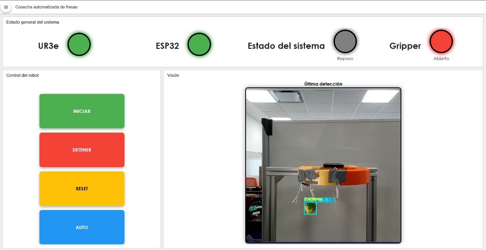
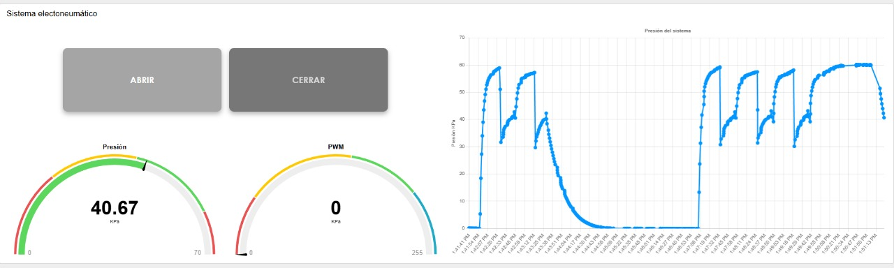
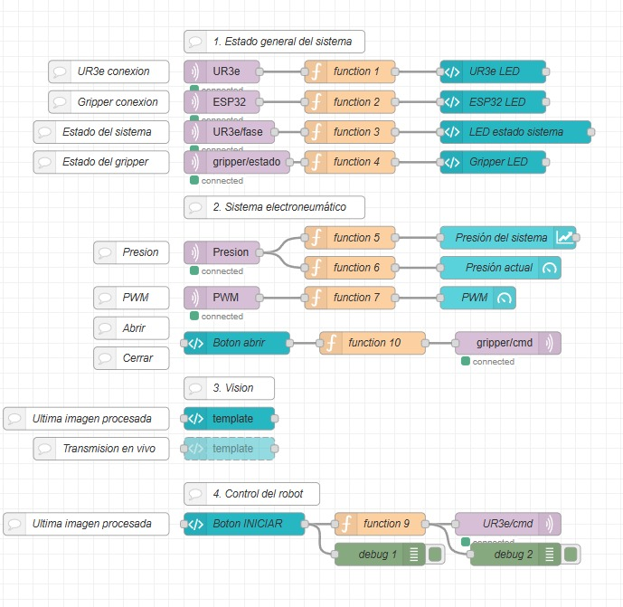

# Berry-Pick-UR3e — Control Dashboard

This dashboard is part of the Berry-Pick-UR3e project, a functional automated strawberry-harvesting system developed by Team Alfresi at Tec de Monterrey, Querétaro.
The interface enables monitoring and control of the robot’s subsystems, integrating computer vision, robotic control, and electro-pneumatic actuation.

## Purpose of the Dashboard

This Node-RED flow centralizes system control and monitoring, making the interaction between hardware and software modules seamless. It operates in real time, supporting both manual and automatic modes, and provides a clear visualization of the robot’s status.

## Dashboard Screenshots

| General System Status | Electro-Pneumatic System | Node-RED |
|------------|-------------|----------|
|  |  |  |

## Dashboard Modules

### 1. General System Status
- **UR3e**: Connection status and operational phase
- **ESP32**: Connection status and pneumatic gripper control
- **Sistema**: Global indicator (idle, active, error)
- **Gripper**: Actuator state (open/closed)

### 2. Electro-Pneumatic System
- **Pressure**: Real-time reading from the ESP32-connected sensor
- **PWM**: Signal control for pneumatic valves
- **Control buttons**: Open / Close gripper

### 3. Computer Vision
- **Last processed frame**: OAK-D Pro camera capture with strawberry detection
- **Live feed**: Continuous visualization of the workspace

### 4. Robot Control
- **Operation buttons**: START, STOP, RESET, AUTO
- **RoboDK integration**: Sends trajectory execution commands to the UR3e

## Integrations

- **Node-RED**: Logical orchestration and dashboard UI
- **Python**: Image processing and detection logic
- **RoboDK**: Robot simulation and trajectory execution
- **Arduino + ESP32**: Pneumatic system control
- **Mosquitto (MQTT)**: Communication across modules

## Flow Structure

The flow is organized into thematic sections:
- `General System Status`
- `Electro-pneumatic System`
- `Vision`
- `Robot Control`

Each section includes input nodes (sensors, buttons), processing functions, and visual outputs (LEDs, charts, images).

## Project Status

This dashboard corresponds to a functional prototype currently in academic validation. The `gripper` branch contains the development of the team’s custom soft pneumatic actuator.

## Credits

Developed by **Alfresi**  
**Tecnológico de Monterrey, Campus Querétaro**

---

