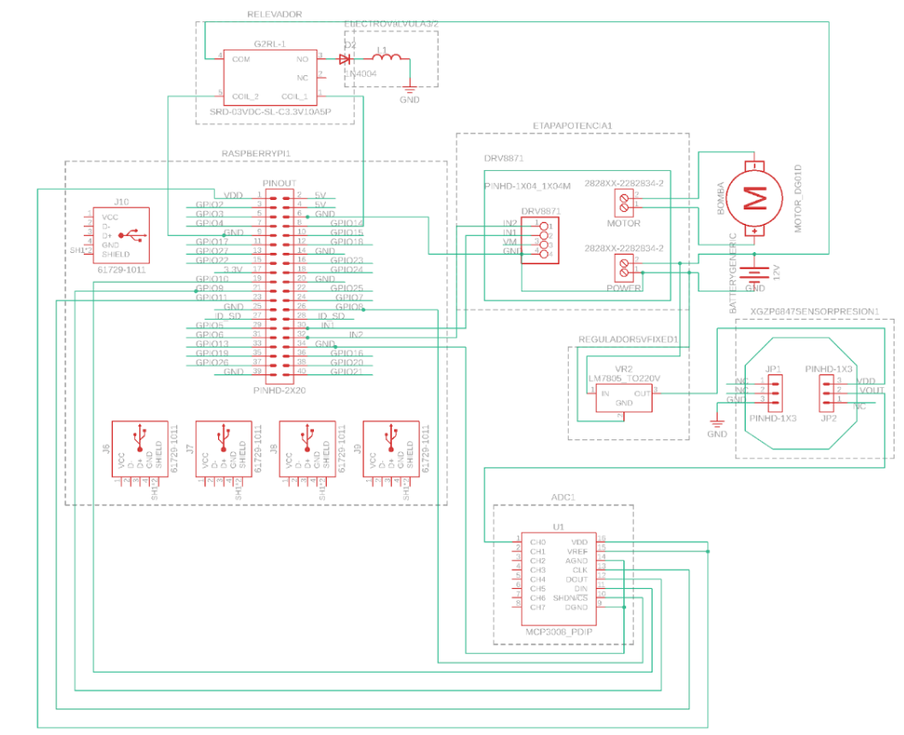

# Soft Gripper – UR3e

This branch contains the design, documentation, and analysis for the **soft pneumatic gripper** developed for the **strawberry harvesting project** using the **UR3e robotic arm**.

---

## Repository Contents
- **ISO Drawings:** Complete technical drawings of petals, base, coupler, camera coupler, and assembly.
- **FEM Simulations:** Non-linear hyperelastic analysis of the gripper fingers.
- **PROBE Data:** Results from the stress/strain and displacement analyses.
- **README.md:** This documentation.

---

## Gripper Geometry
The gripper is designed as a **5-finger petal-type soft actuator**:

- **Finger layout:**  
  - 5 symmetric petals for uniform distribution around the base.
  - Each finger has **6 semicircular pneumatic chambers** for smooth, controlled bending.
- **Base:**  
  - Pentagonal shape for even force distribution.
  - Designed to interface with both the gripper fingers and the coupler.
- **Finger dimensions:**  
  - Width: **12 mm**  
  - Length: **81 mm**  
  - Thickness: **7.5 mm** (without chamber volume)
- **Grasping area:**  
  - Effective diameter: **≈ 50 mm**, suitable for enveloping the strawberry while supporting the peduncle.

---

## Actuation
- **Pneumatic Chambers:**  
  - Semicircular geometry for uniform internal expansion and reduced resistance.
  - Ensures enveloping motion that protects the strawberry fruit and securely holds the peduncle.
- **Operating Pressure:**  
  - Nominal actuation pressure: **17.5 kPa**
- **Analysis:**  
  - Finite Element Model (FEM) with **Tetrahedral mesh**.
  - Non-linear simulation considering **hyperelastic material behavior**.
  - Rigid-body constraints applied at the finger-base interface.

---

## Material & Casting
- **Finger mold material per petal:** **16 ml elastomer**
- **Elastomer type:** [Specify, e.g., *Ecoflex 00-30*]
- **Casting notes:**  
  - Degas the elastomer before pouring to minimize trapped air bubbles.
  - Ensure consistent fill for all 5 petals to maintain uniform actuation.

---

## Mechanical Interfaces
- **Gripper Base:**  
  - Pentagonal rigid platform where the soft fingers are mounted.
  - Provides structural stability and connection to pneumatic lines.

- **UR3e Coupler:**  
  - Secure mechanical interface between the gripper base and the **UR3e robot flange**.
  - 3D printed

- **Camera Coupler:**  
  - Designed to mount a vision system (camera) fixed to the gripper assembly.
  - Allows correct alignment for **visual feedback and ROI adjustments** during harvesting.

Drawings for all these components are included in `drawings/`.

---

## Assembly & Integration
1. **Mold the fingers:** cast 5 petals using 16 ml of elastomer each.
2. **Attach fingers to the base:** ensure even spacing and airtight sealing.
3. **Connect pneumatic lines:** secure and test all chambers for leaks.
4. **Mount the coupler:** attach the gripper to the UR3e flange.
5. **Install camera coupler:** align and secure the camera to the gripper assembly.
6. **Testing:**  
   - Begin with low-pressure tests off-robot.  
   - Increase gradually to nominal pressure (17.5 kPa).  
   - Verify consistent finger actuation and camera field of view.

## Electrical Diagram
  

---

## Safety & Testing
- Avoid pressures above **17.5 kPa** unless validated by further FEM tests.
- Check seals, pneumatic tubing, and coupler connections before each test.
- Inspect elastomer fingers after each harvesting session for wear or micro-tears.

---

## Future Additions
- ISO drawings and 3D renders of the camera coupler.
- Photos of the casting, assembly, and testing processes.
- Integrated test results with vision-based ROI switching.
- Videos of field harvesting performance.

---

*Maintained by ALFRESI – Strawberry Harvesting Project*  
*Tec de Monterrey – Campus Querétaro*

